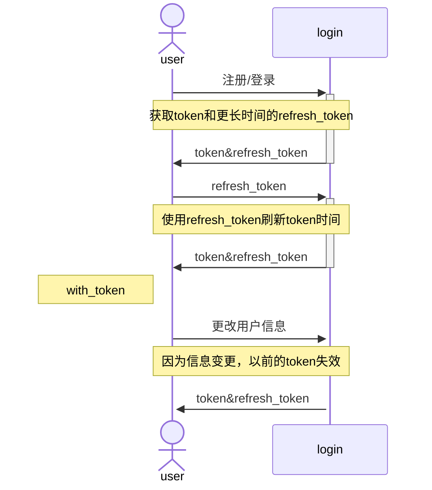
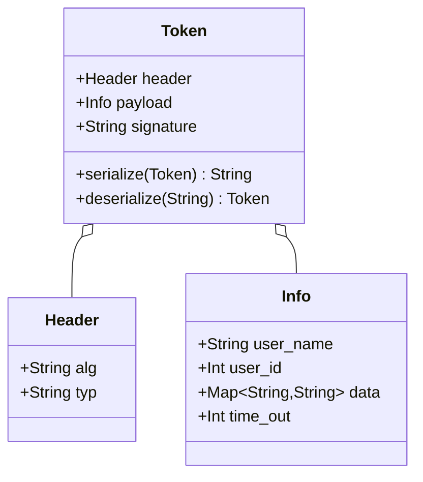

```mermaid
sequenceDiagram
    actor u as user
    participant l as login
    u->>+l: 注册/登录
    note over u,l: 获取token和更长时间的refresh_token
    l->>-u: token&refresh_token
    u->>+l: refresh_token
    note over u,l: 使用refresh_token刷新token时间
    l->>-u: token&refresh_token
    note left of u:with_token
    u->>+l: 更改用户信息
    note over u,l: 因为信息变更，以前的token失效
    l->>+u: token&refresh_token

```

```mermaid
classDiagram
class Token{
    +Header header
    +Info payload
    +String signature
    +serialize(Token) String
    +deserialize(String) Token
}

class Header{
    +String alg
    +String typ
}

class Info{
		+String user_name
		+Int user_id
		+Map~String,String~ data
		+Int time_out
}

Token o-- Header
Token o-- Info
```

