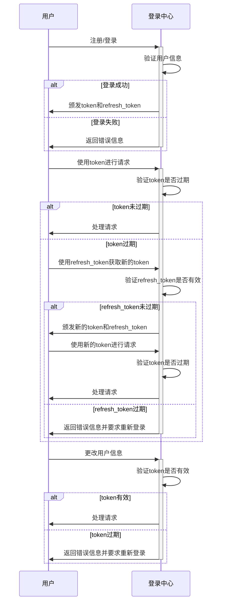
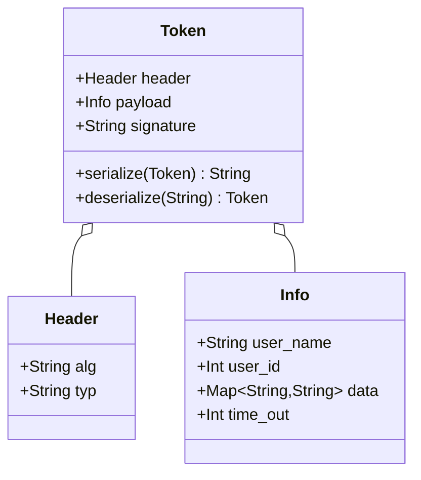

```mermaid
sequenceDiagram
    participant User as 用户
    participant Login as 登录中心

    User->>+Login: 注册/登录
    Login->>Login: 验证用户信息
    alt 登录成功
        Login->>User: 颁发token和refresh_token
    else 登录失败
        Login->>-User: 返回错误信息
    end

    User->>+Login: 使用token进行请求
    Login->>Login: 验证token是否过期
    alt token未过期
        Login->>User: 处理请求
    else token过期
        User->>Login: 使用refresh_token获取新的token
        Login->>Login: 验证refresh_token是否有效
        alt refresh_token未过期
            Login->>User: 颁发新的token和refresh_token
            User->>Login: 使用新的token进行请求
            Login->>Login: 验证token是否过期
            Login->>User: 处理请求
        else refresh_token过期
            Login->>-User: 返回错误信息并要求重新登录
        end
    end

    User->>+Login: 更改用户信息
    Login->>Login: 验证token是否有效
    alt token有效
        Login->>User: 处理请求
    else token过期
        Login->>-User: 返回错误信息并要求重新登录
    end
```

```mermaid
classDiagram
class Token{
    +Header header
    +Info payload
    +String signature
    +serialize(Token) String
    +deserialize(String) Token
}

class Header{
    +String alg
    +String typ
}

class Info{
		+String user_name
		+Int user_id
		+Map~String,String~ data
		+Int time_out
}

Token o-- Header
Token o-- Info
```

