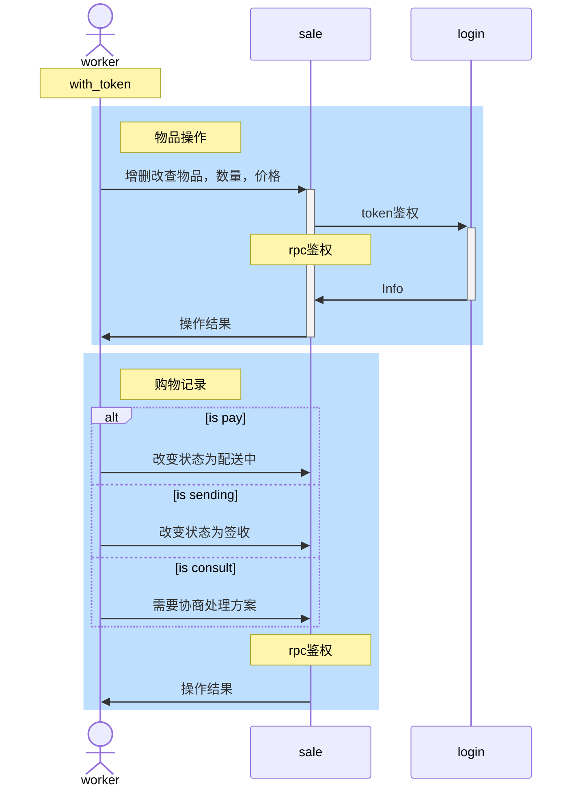
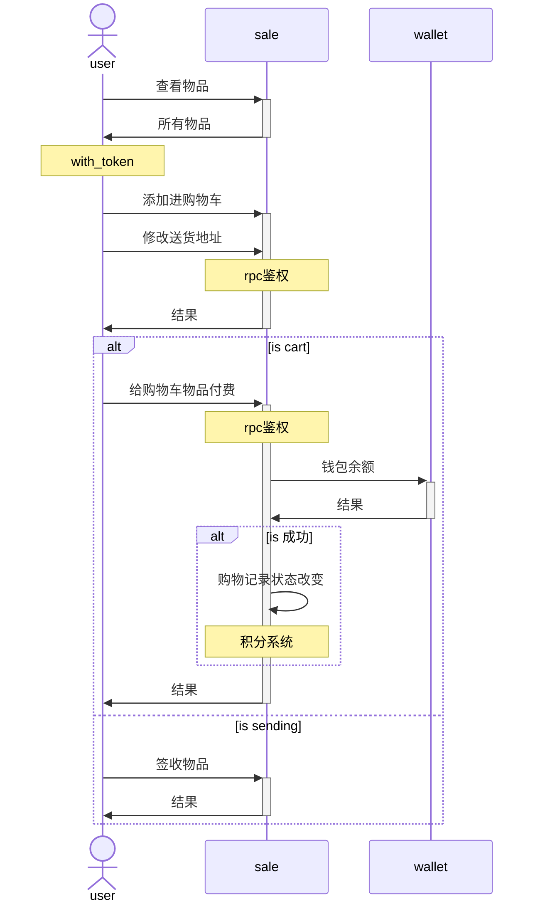
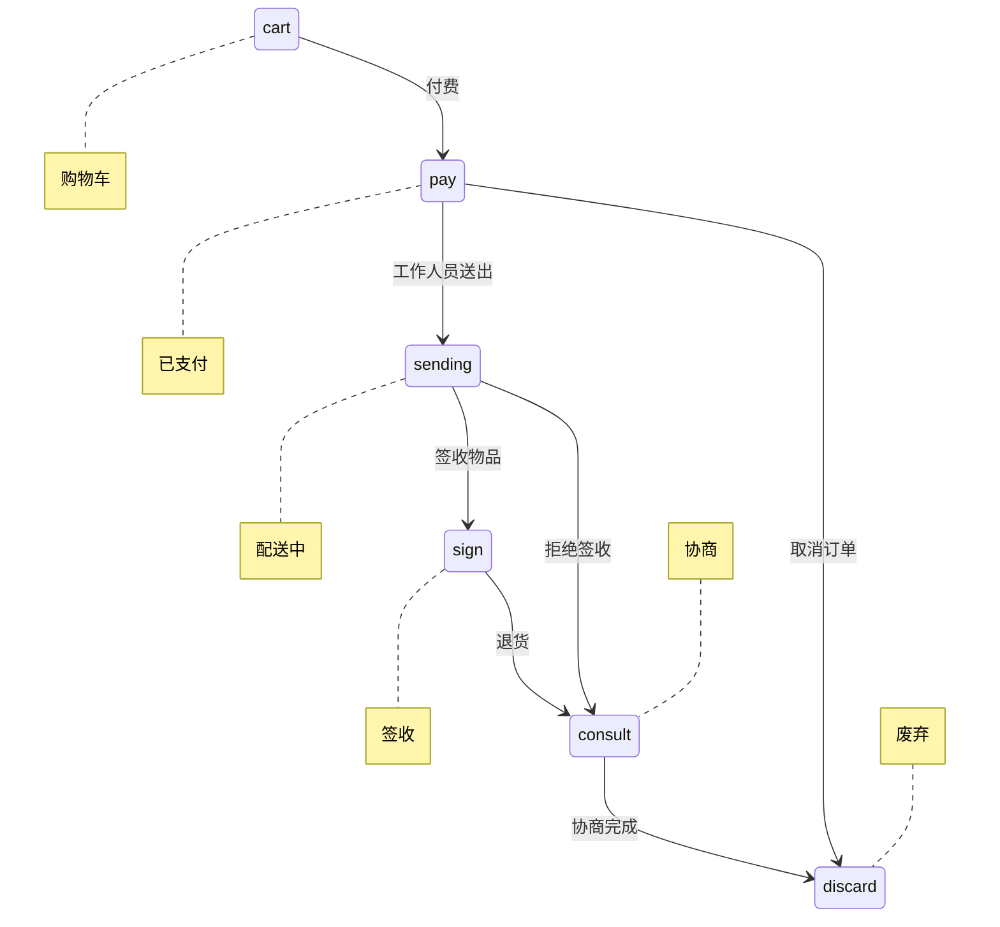

```mermaid
sequenceDiagram
		actor w as worker
    participant s as sale
    participant l as login
    note over w:with_token
    
    rect rgb(191, 223, 255)
    note right of w:物品操作
    w->>+s:增删改查物品，数量，价格
    s->>+l:token鉴权
    note over s: rpc鉴权
    l->>-s: Info
    s->>-w:操作结果
    end
    
    rect rgb(191, 223, 255)
    note right of w:购物记录
    alt is pay
    w->>s:改变状态为配送中
    else is sending
    w->>s:改变状态为签收
    else is consult
    w->>s: 需要协商处理方案
    end
    note over s: rpc鉴权
    s->>w:操作结果
    end
   


```

```mermaid
sequenceDiagram
		actor u as user
    participant s as sale
    participant w as wallet
    u->>+s:查看物品
    s->>-u:所有物品
    note over u:with_token
    u->>+s:添加进购物车
    u->>s:修改送货地址
    note over s: rpc鉴权
    s->>-u:结果
    
    alt is cart
    u->>+s:给购物车物品付费
    note over s: rpc鉴权
    s->>+w: 钱包余额
    w->>-s: 结果
    alt is 成功
    s->>s: 购物记录状态改变
    note over s:积分系统
    end
    s->>-u:结果
    
    else is sending
    u->>+s:签收物品
    s->>-u:结果
    end


```

```mermaid
stateDiagram-v2
		c:cart
		note right of c: 购物车
		p:pay
		note right of p: 已支付
		se:sending
		note right of se: 配送中
		si:sign
		note right of si: 签收
		d:discard
		note left of d: 废弃
		co:consult
		note left of co: 协商
		c-->p:付费
		p-->d:取消订单
		p-->se:工作人员送出
		se-->co:拒绝签收
		se-->si:签收物品
		si-->co:退货
		co-->d:协商完成
		
```

