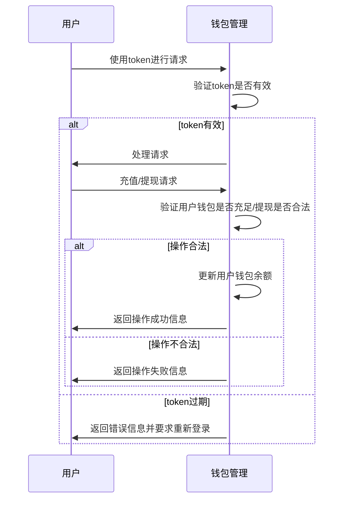

```mermaid
sequenceDiagram
    participant User as 用户
    participant Wallet as 钱包管理

    User->>+Wallet: 使用token进行请求
    Wallet->>Wallet: 验证token是否有效
    alt token有效
        Wallet->>User: 处理请求
        User->>+Wallet: 充值/提现请求
        Wallet->>Wallet: 验证用户钱包是否充足/提现是否合法
        alt 操作合法
            Wallet->>Wallet: 更新用户钱包余额
            Wallet->>User: 返回操作成功信息
        else 操作不合法
            Wallet->>User: 返回操作失败信息
        end
    else token过期
        Wallet->>User: 返回错误信息并要求重新登录
    end
    
```

```mermaid
sequenceDiagram
    participant User as 用户
    participant Wallet as 钱包管理

    User->>+Wallet: 使用token进行请求
    Wallet->>Wallet: 验证token是否有效
    alt token有效
        Wallet->>User: 处理请求
        User->>+Wallet: 充值/提现请求
        Wallet->>Wallet: 验证用户钱包是否充足/提现是否合法
        alt 操作合法
            Wallet->>Wallet: 更新用户钱包余额
            Wallet->>User: 返回操作成功信息
        else 操作不合法
            Wallet->>User: 返回操作失败信息
        end
    else token过期
        Wallet->>User: 返回错误信息并要求重新登录
    end

```

